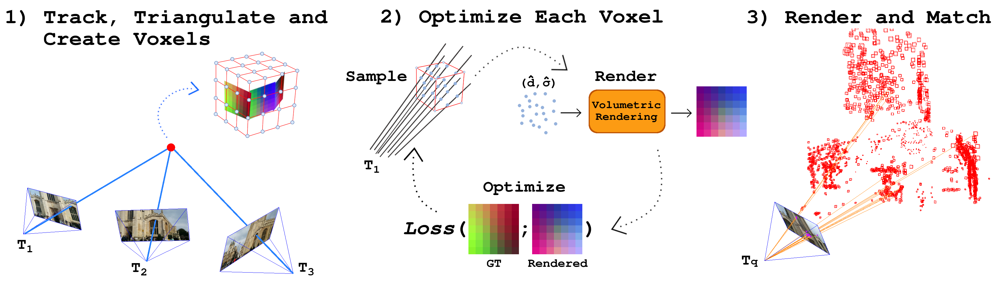

FaVoR Documentation
===================

About
-----
FaVoR is a 3D representation of keypoints descriptors, which
can be used for camera relocalization.
If you use plan to use FaVoR for your research, please cite::

        @misc{polizzi2024arXiv,
           title={FaVoR: Features via Voxel Rendering for Camera Relocalization},
           author={Vincenzo Polizzi and Marco Cannici and Davide Scaramuzza and Jonathan Kelly},
           year={2024},
           eprint={2409.07571},
           archivePrefix={arXiv},
           primaryClass={cs.CV},
           url={https://arxiv.org/abs/2409.07571},
        }
